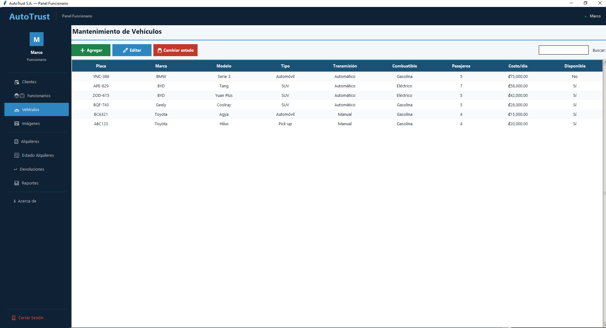
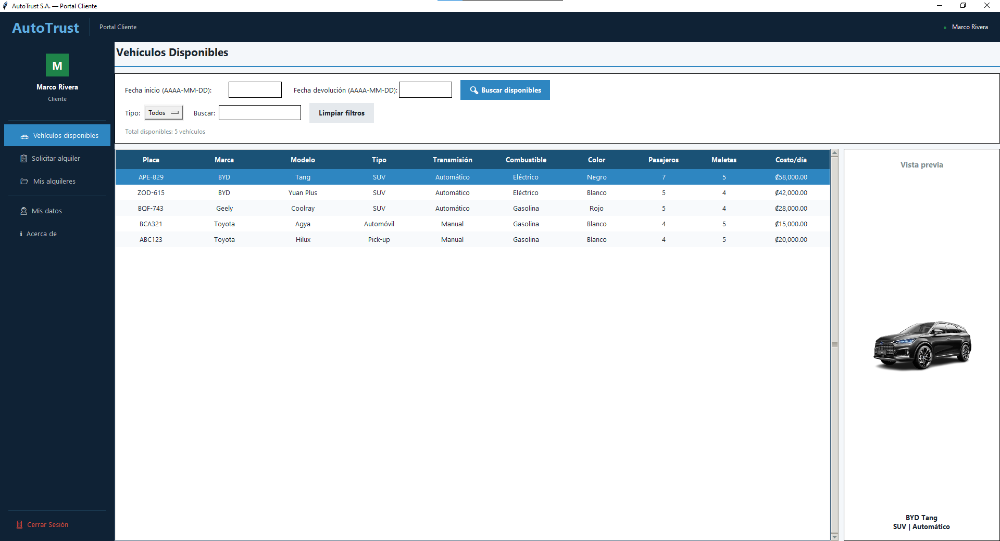
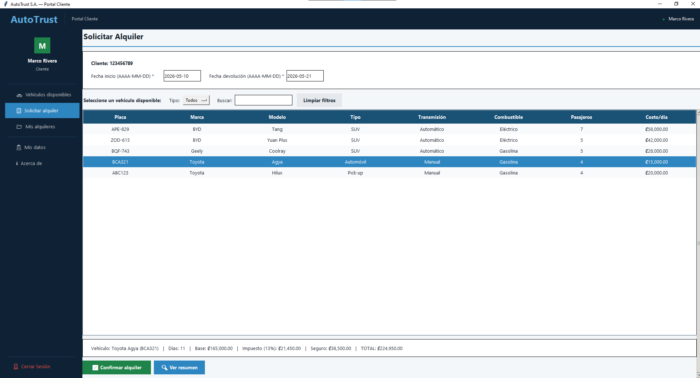

# AutoTrust - Vehicle Fleet Management System

Desktop application developed in Python for vehicle fleet and rental management.

This project was developed as part of the Programming III course and focuses on the administration of vehicle rentals, customer management, employee management, and rental tracking using graphical interfaces and database integration.

## Features

- Customer and employee management
- Vehicle registration and availability tracking
- Vehicle rental and return management
- Automatic rental cost calculations
- Late return penalties and damage charges
- SQL Server and MongoDB integration
- Graphical user interface developed with Tkinter
- Reports and data visualization
- Vehicle image support
- Input validations and logical deletion handling

## Technologies Used

- Python
- Tkinter
- SQL Server
- MongoDB
- ODBC Driver 17
- Matplotlib

## Project Structure

- `interfaz/` → graphical user interfaces
- `negocio/` → business logic
- `datos/` → data access layer
- `entidades/` → entities and models
- `config/` → database configuration
- `scripts/` → SQL and MongoDB scripts

## Screenshots

### Main Menu

### Vehicle Management

### Rental System

## Purpose

This project was developed as part of a Programming course and created to strengthen knowledge in:
- software development
- desktop application development
- database management
- layered architecture
- object-oriented programming

## Author

Marco Rivera
